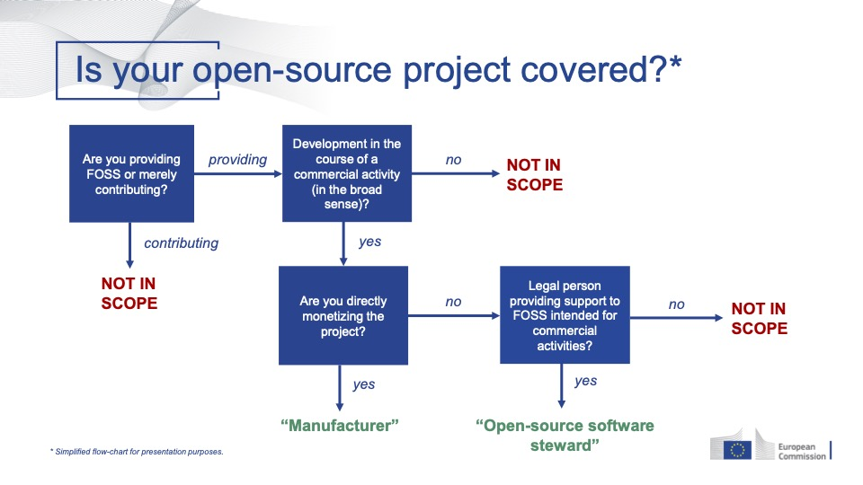

I had another busy FOSDEM this year - wearing too many hats and running between 1 booth and 4 devrooms. I was exhausted. But one thing I think I care about the most is the CRA (Cyber Resilience Act). While there are many sessions about it, I think the best are the sessions in FOSDEM that we have [Benjamin Bögel](https://fosdem.org/2024/schedule/speaker/7PS7PX/) and [Omar Ennaji](https://fosdem.org/2024/schedule/speaker/PDBC78/) from the European Commission to give us first-hand information and talk to participants about the upcoming CRA and PLD (Product Liability Directive) amendments. In this blog post, we will focus on CRA.

*Here is what I summarise, please also note that the thoughts and opinions in this blog post are solely my personal opinions.*

## CRA in a nutshell

A common way to put it simply is "to put a CE marking on the product". Traditionally, when we think of a product with a CE marking, we think of something physical, something that you can touch. It is quite easy to imagine the CRA will apply to hardware like laptops, phones, IoT devices, CPU chips etc. However, CRA will also cover software including OS, apps - and even packages and libraries. It also includes remote data processing solutions, which means, let's say if you make a query to a cloud database, the software that handles the query should also be CRA compliance.

Note that it only applies to commercial products. Hobby projects, websites and standalone SaaS services are not in scope.

That is a lot to take in, how do I know if my open source projects are in scope? When I will be held accountable as a contributor? We will look in-depth into what is in and out of scope in a bit.

## Is my FOSS project in scope?

If you look at this simplified flow chat from the presentation of the [The Regulators Are Coming: One Year On](https://fosdem.org/2024/schedule/event/fosdem-2024-3683-the-regulators-are-coming-one-year-on/) session you will see two questions you have to ask is:

1. Are you the legal owner of the project?
2. Are you monetising **directly** from the project?

If both the questions are no, you are pretty safe. But if your answer to the first question is yes. There is a chance that you can be an open source software steward instead.

## What is open source software steward?

If the project that you or your organisation own or maintain legally, and the project is intended for commercial use, then you may classify as the open source software steward if you are not monetising from the project directly.

As an open source software steward, you still have some obligations even though you are not putting a CE marking on the software. Some of them include:

- Put in place a cybersecurity policy taking into account the specific nature of the open-source software steward
- Cooperate with market surveillance authorities
- Report incidents and vulnerabilities to the extent that they are involved in the development.

So what we will see is that some projects would need to have an organisation that acts as their steward to fulfil the above obligations. And more organisations would have an incentive to become a [CVE Numbering Authority](https://www.cve.org/ProgramOrganization/CNAs).

## When is it going to happen?

Right now we can expect the CRA will be voted on this year and after there will be around 2-3 years for it to take full effect. The clock is ticking and we have to be prepared early for what is to come in a few years.

I think there is nothing to be scared of, once we are sure of what requirements are needed, we can adopt new industry standards and provide safer software.

## What should we do now?

As an individual developer:

- Education yourself in CRA and pay attention to what implications it has
- Join constructive discussions, especially with the foundations and organisations that support open source software and ecosystems

As a project maintainer:

- Do all of the above as individual developers, plus;
- Be prepared to review the cybersecurity policy and the incidents and vulnerabilities reporting mechanisms when the guideline of CRA compliance is more clear
- If appropriate, get up a governing body that will be able to take up the role of an open source software steward

As a potential open source software steward:

- Be prepared to fulfil the CRA obligations
- Communicate with other potential open source software stewards, e.g. foundations and organisations, for constructive discussions
- Communicate with your community regarding CRA, tell them you have plans to get ready for CRA and what the plan is

---

Final words: I think we should look at CRA with a constructive mindset, we have time to get the community and the industry to be ready. Let's hope the outcome will be beneficial to everyone.
