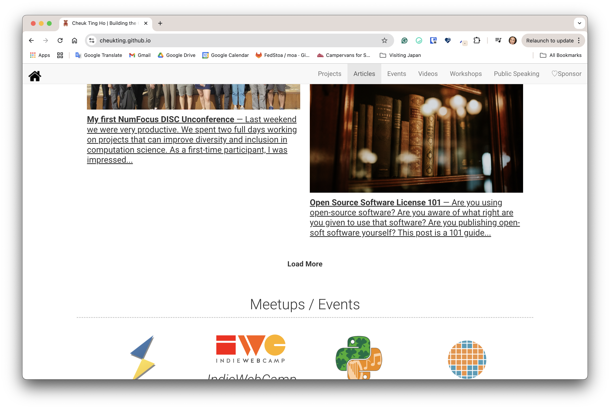
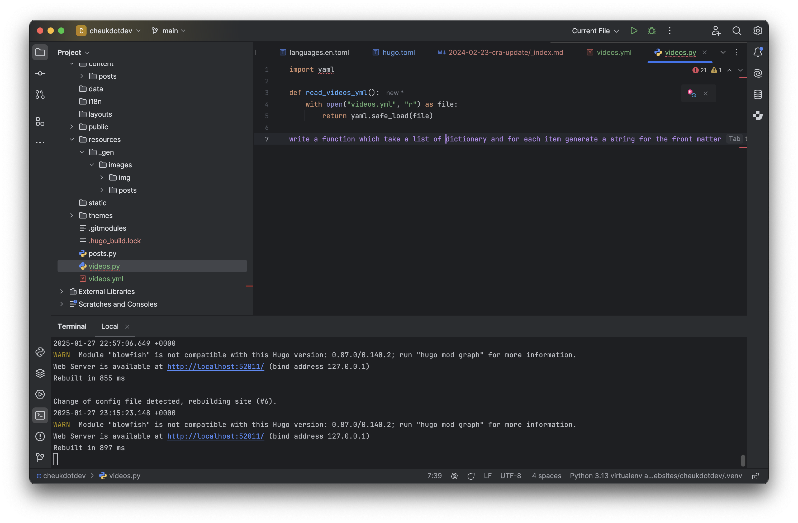
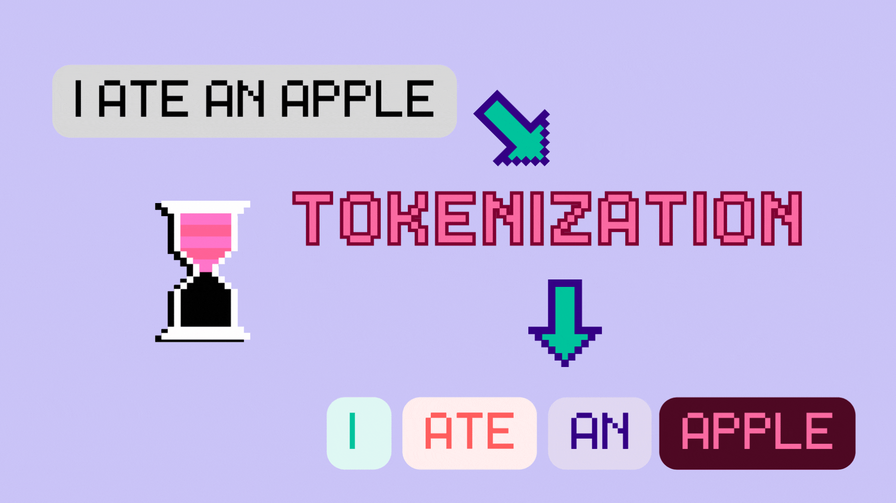
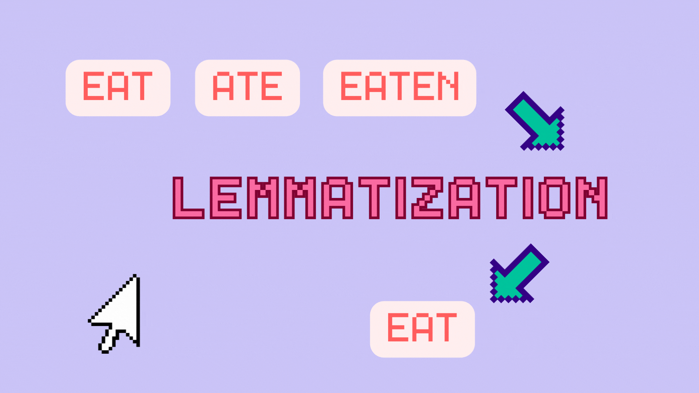
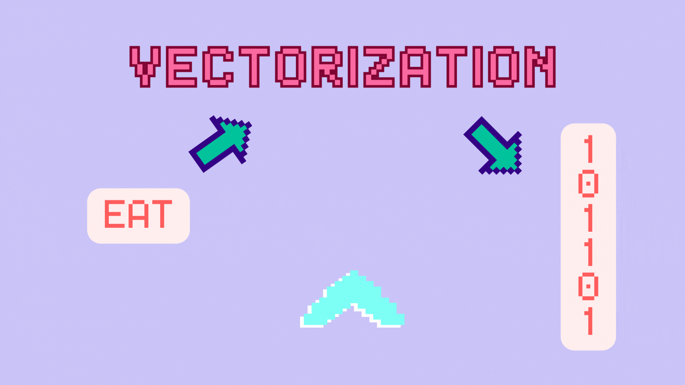

## Website migrations

It has been a year since I didn anything for my website. The truth is, I got fed up with the [Jekyll](https://jekyllrb.com/) template that I was using. Over the years I have hack around with no Ruby on Rail knowlesge and made a big mess. Also as the content grew, the infinite scrolling design become super annoying when older content need to be found.

As wanted to start a new, I decided to switch to using [Hugo](https://gohugo.io/), which I have used when helping with [PyLadiesCon](https://conference.pyladies.com/) and having an interest. After searching around, I found a theme, [Blowfish](https://blowfish.page/),  which I think have the potential to be customize to the website that I want. It is well documented so picking it up as a Hugo newbie is not too hard. However, I have another challange.

While Hugo also support contents in markdown format and data files in YAML format which I used in my old website. The file structure i need in the new website is totally different. I also have some YAML file in the old website which, with a lot of hacking, was used to generate pages. So, to keep it neet and tidy in the new website, and to avoid hacking too much, I decided to do what I do best. I am going to write some Python script to transform the old files into the new ones.

This is where the power of AI comes in! Since I started woking with [JetBrains](https://www.jetbrains.com/), I have been encouraged to test out their AI coding assitants. The inline prompt saves me time to fetch the Python code to read YAML files and clean up strings with Regex. I am not a big fan of Regex and to figure out what patten to use is annoying. Although AI Assitant is not perfect at every shot. It gives me something to start with, then I varify with a [Regex tester](https://regex101.com/) online and modify it. It is quite convinence.

Here are a few tips that I discover when using AI Assitant:

- Be precise, a prompt like "remove square brackets" would work better than "clean up markdown formats"
- Use technical terms, like "front matter" and "url-safe", they are good cues for the model to generate the right code for you.
- One step at a time, break down tasks into smaller tasks so it is easier for AI to get it right. It is also easier to make adjustments.

---

## Good prompt or bad prompt

These leads me down the rabbit hole, what makes a good prompt? First, we need to look at how your prompt get processed by an LLM.

### 1. Tokenization

The first step in making a machine, who works with numbers, into processing a natural language, which consist of complex logics and contexts, is tokenization. This is a key process within NLP (Natural Language Processing). Sentances are analized and broken into chunks of ideas (i.e. tokens) and then being processed. 

### 2. Lemmatization

Most of the time these tokenized words will also go through lemmatization to extract their based form. In lanugages such as English and many other European languages, word changes forms due to different situations in a sentance. To make sure tokenized words in different forms are normalization and consider the same can have some advantage in other NLP processes.

### 3. Vectorization

One way of processing the tokens is to vectorize it so it become numbers which can be processed by the neural network. Althoug there are many different methods to do so, the logic of vectorizing is trained on the relationship between different words. That's why a lot of textual data are required to train a general purpose model.

---

Let's go back to our prompt, the process of how it went through tokenization, lemmatization and vectorization give us a hit. I speculate that, if we use precise terms like "function", "dictionary" and "strings", these words are commony used in a Python documentation and they would probalbly have a proximity to each other and could give a result with less noise. Therefore, as a conclusion, when using AI Assitant in coding, "speaking like a programmer" would give you a huge advantage.

