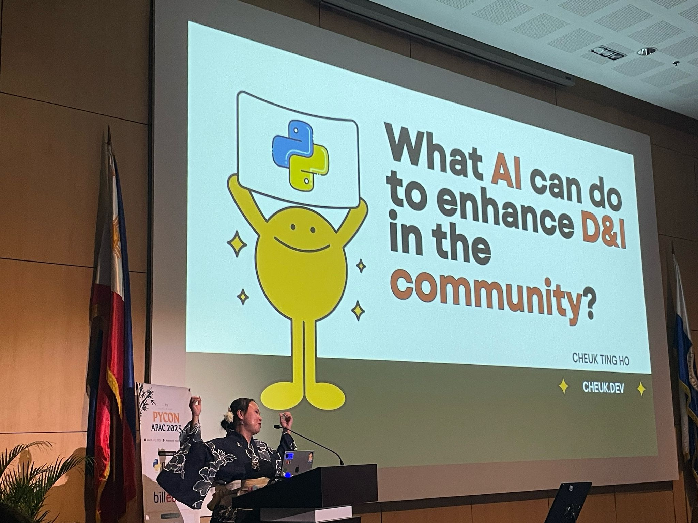
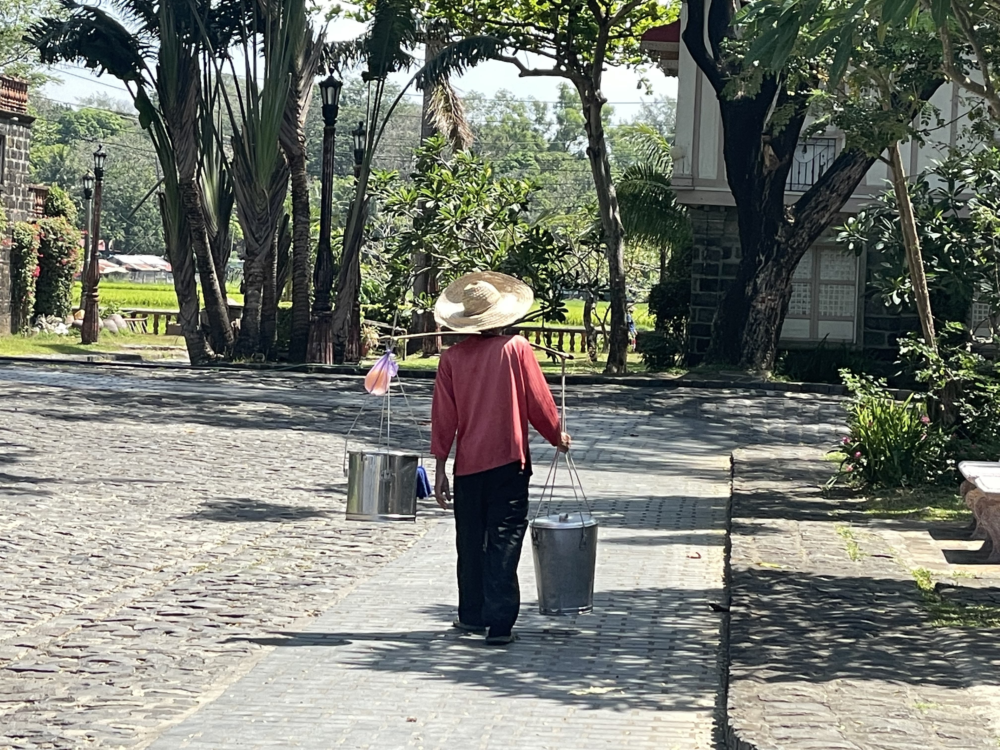

## Wait, what? Last PyCon APAC?

Yes... you heard it. However, it is not the end of it. Iqbal Abdullah, one of the founder of [Python Asia Organization (PAO)](https://ariregister.rik.ee/eng/company/80644409/Python-Asia-Organization-MT%C3%9C) announced at the conference that, the name "PyCon APAC" will be retired, rebrand and relaunch - please see the details [in his blog post](https://iqbalabdullah.net/en/posts/2025/03/the-final-pycon-apac/).

## I am honour to be part of it

That being said, I am so glad to be part of this year's PyCon APAC, to witness such a big change in the Python Asia community. It started in last year's PyCon APAC, the organising team invited me to give a keynote at this year's [PyCon APAC in Manila](https://pycon-apac.python.ph/), a fascinating city. The people here are such good at hospitality, I feel so welcomed everywhere and people are so friendly. Also, it seems everyone here is born to sing - you can hear a random stranger humming to a tune everywhere you go. This culture can be seen at the conference, the organizers created a conference that has welcomed community members from around the world.They even organise a PyNight event where everyone can show their talent (or lack there of) after the conference has concluded.

*Thank you for giving me the oppotunity to give a keynote at this special conference*

## We all speak different languages but we are one community

One thing that strike me is that, in every PyCon APAC, there will be representative of communities from different regions/ countries participating - from Indonesia, Taiwan, Japan, Malaysia, Singapore, India, Korea and Hong Kong. I realized myself switching from languages to languages when talking to friends from difference places, but we all speak one language - Python! Even folks speak different mother-tongue, we all hang out together, share our experience (and food) with each other. This kind of respect and openness is the spirit of the Python community and I can see that a lot in PyCon APAC and I love it!

## Work hard and play hard

The conference concluded at the closing, but it does not mean that the event stops there. the day after we have the sprints where folks work on open source and digital public goods projects together. It is the first time after the pandemic that PyCon PH has done it and the turn out is not bad. My only complain was that the coffee group order in the morning got canceled by the coffee shop and I didn't get to drink the famous ube coffee during the sprint.

Then after the sprint, we have a fun outing day, organisers and speakers were invited and since we are all young at heart it feel like we are back in school field trip again! We have a culture tour to *[Las Casas Filipinas de Acuzar](https://www.lascasasfilipinas.com/)* - 3 hours drive from Manila and we got to nap and chat in the van (I think we were all too tired to sing). Unfortunately we have a heatwave on that day so the culture tour was exhausting. It was fun but maybe we can do a spa day next time instead. During the trip I also discover other hidden talent of our community members - tour guiding and diving. I also discovered that you can buy chicken alive in the Philippines - we have found one in one of our vans.

*Someone is selling Taho (Filipino Sweet Tofu Dessert) at Las Casas Filipinas de Acuzar*

## Big thank you to making this happened

I have to thank everyone who where a part of this conference - the founder and director of PAO *(Kwon Han Bae, Freilla Espinola, Manabu Terada, Iqbal Abdullah)*; [the organizers and volunteers of PyCon PH and host of PyCon APAC 2025](https://pycon-apac.python.ph/volunteers/); all the sponsors including [JetBrains](https://www.jetbrains.com/) and our partner [Tangunsoft](https://www.tangunsoft.com/); and everyone who where there with me to share this memorable conference with.
