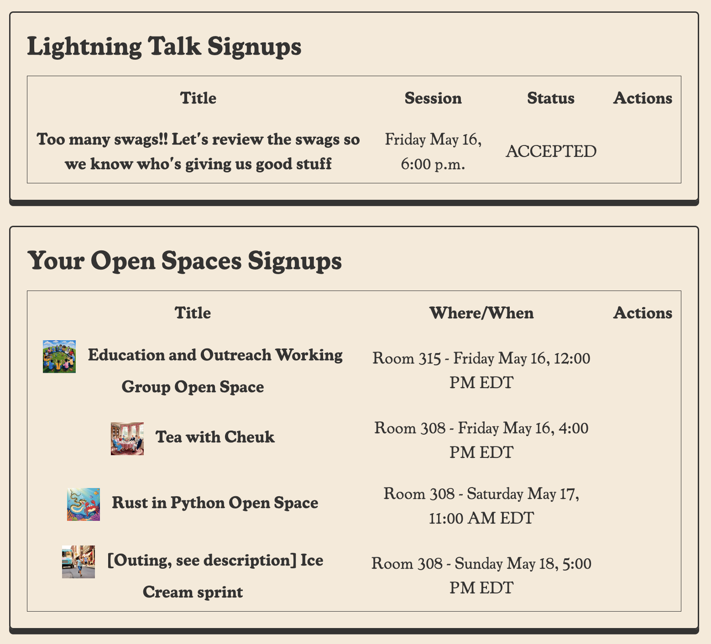
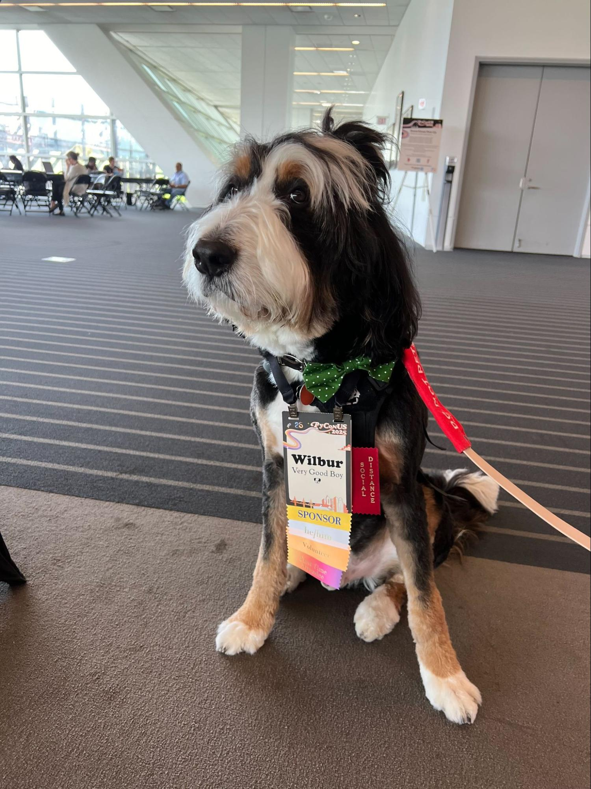

This year PyCon US 2025 in Pittsburgh has been wrapped up. This is our second year back in the David L. Lawrence Convention Center. It is a lovely venue and is near a lot of nice places for food and drinks.

<blockquote class="bluesky-embed" data-bluesky-uri="at://did:plc:h2aztadsbjaizzjqfwqtj2d4/app.bsky.feed.post/3loyssvgwyk2f" data-bluesky-cid="bafyreih7lk54s7j2u2agrks4q25hp22ssktdhbwkl7eans7iywzujvm62e" data-bluesky-embed-color-mode="system">
We&#x27;re here! 

See you at #PyConUS 2025 in just a few short days!  <a href="https://bsky.app/profile/did:plc:h2aztadsbjaizzjqfwqtj2d4/post/3loyssvgwyk2f?ref_src=embed">[image or embed]</a>
&mdash; PyCon US (<a href="https://bsky.app/profile/did:plc:h2aztadsbjaizzjqfwqtj2d4?ref_src=embed">@pycon.us</a>) <a href="https://bsky.app/profile/did:plc:h2aztadsbjaizzjqfwqtj2d4/post/3loyssvgwyk2f?ref_src=embed">May 12, 2025 at 4:31 PM</a></blockquote>

As Deb, our executive director of the PSF pointed out, this year we are in a “weird” time. Apparently there are more weirdos at PyCon than those who know what PSF is. We may need to fix that (hopefully at the conference). But we are still having a lot of fun at PyCon US this year. We are also looking forward to going to Long Beach, CA for the next PyCon\!

<blockquote class="bluesky-embed" data-bluesky-uri="at://did:plc:7qwxwi5kfufaok5bq27zkbfp/app.bsky.feed.post/3lpc6qbs5ok2s" data-bluesky-cid="bafyreifvhxpa5simcuxb7u2qokdg3v7ucztqvoujrlkdebyl2u5p3kwivy" data-bluesky-embed-color-mode="system">
Stay weird! #PyConUS  <a href="https://bsky.app/profile/did:plc:7qwxwi5kfufaok5bq27zkbfp/post/3lpc6qbs5ok2s?ref_src=embed">[image or embed]</a>
&mdash; KwonHan Bae (<a href="https://bsky.app/profile/did:plc:7qwxwi5kfufaok5bq27zkbfp?ref_src=embed">@darjeeling.bsky.social</a>) <a href="https://bsky.app/profile/did:plc:7qwxwi5kfufaok5bq27zkbfp/post/3lpc6qbs5ok2s?ref_src=embed">May 16, 2025 at 9:58 AM</a></blockquote>

## Open Space and Lighting Talk signup went digital

<blockquote class="bluesky-embed" data-bluesky-uri="at://did:plc:26qgyaxbfjiof2smv4k3fwtr/app.bsky.feed.post/3lpc5t53jv22w" data-bluesky-cid="bafyreifahsxtvf3kiti7zdfnfcofznsjzvv4lwlilbczfvvpyf4aa5rxly" data-bluesky-embed-color-mode="system">
Sign up for ⚡️⚡️ lightning talks ⚡️⚡️ NOW! Questions? Me @chrisjrn.fyi @cristianmauricio.bsky.social &amp; Abigail (www.instagram.com/mesrenyamedo...) are y’all’s hosts and go to for questions! And if you run a #Python conf tell us! We want you to plug y’all’s event at #PyConUS! A single slide shall do.  <a href="https://bsky.app/profile/did:plc:26qgyaxbfjiof2smv4k3fwtr/post/3lpc5t53jv22w?ref_src=embed">[image or embed]</a>
&mdash; Lorena Nicole (<a href="https://bsky.app/profile/did:plc:26qgyaxbfjiof2smv4k3fwtr?ref_src=embed">@lorenanicole.bsky.social</a>) <a href="https://bsky.app/profile/did:plc:26qgyaxbfjiof2smv4k3fwtr/post/3lpc5t53jv22w?ref_src=embed">May 16, 2025 at 9:42 AM</a></blockquote>

If you don’t know yet, lighting talks and open spaces are my favourite part of the conference. This year we can sign up and check the schedule online which makes it really convenient and improves the attendee experience a lot. This year I am not hosting the lighting talks any more but I have given one lighting talk. I have also done four open spaces this year which is A LOT\!

Apparently there are a lot of people who asked me “Are you the one doing the tea party open space?” so I may have to do it again next year \- I will have to remember to bring my travel kettle.

## A Very Good Boy joins the JetBrains booth team

Although I got little time working at the booth due to a million other things at the conference, I am glad to be part of the team.

<blockquote class="bluesky-embed" data-bluesky-uri="at://did:plc:yqcr73bjh24zp5hkzdv25mvn/app.bsky.feed.post/3lpjpb4u2yc2p" data-bluesky-cid="bafyreibb4tufpzntmn6gvisjfqfsvjpx5gwpdryj4o22n67wrvu5bhmnqa" data-bluesky-embed-color-mode="system">
Smiles, swag, and Python spirit 🐍

We’re happy to be part of the coolest #Python community at #PyConUS 2025!  <a href="https://bsky.app/profile/did:plc:yqcr73bjh24zp5hkzdv25mvn/post/3lpjpb4u2yc2p?ref_src=embed">[image or embed]</a>
&mdash; PyCharm, a JetBrains IDE (<a href="https://bsky.app/profile/did:plc:yqcr73bjh24zp5hkzdv25mvn?ref_src=embed">@pycharm.dev</a>) <a href="https://bsky.app/profile/did:plc:yqcr73bjh24zp5hkzdv25mvn/post/3lpjpb4u2yc2p?ref_src=embed">May 19, 2025 at 9:43 AM</a></blockquote>

And I am so happy to meet this very good boy again.

There’s so much fun showing folks Junie and having a play with it and seeing it recreate other people’s project in a short amount of time.

## 

## PyLadies Auction is still awesome

This year I was pulled into being an auctioner/ runner and it was fun helping to get more donations to PyLadies. This year we also have an accurately sized Guido cut out (compared to last year’s shorter cutout) and a giant snake for auction.

<blockquote class="bluesky-embed" data-bluesky-uri="at://did:plc:wjg3pg6vybvngg7arwmw6vxx/app.bsky.feed.post/3lpfmitpjbd2d" data-bluesky-cid="bafyreietzk7oikbrgvnrvhmnwzmpxlp2ybrzkjmjkbigzut4qgc4dc2q7e" data-bluesky-embed-color-mode="system">
One of us is going to take Guido or the giant #Python (or both) home from #PyLadies auction 😁  <a href="https://bsky.app/profile/did:plc:wjg3pg6vybvngg7arwmw6vxx/post/3lpfmitpjbd2d?ref_src=embed">[image or embed]</a>
&mdash; Cheuk Ting Ho (<a href="https://bsky.app/profile/did:plc:wjg3pg6vybvngg7arwmw6vxx?ref_src=embed">@cheukting.bsky.social</a>) <a href="https://bsky.app/profile/did:plc:wjg3pg6vybvngg7arwmw6vxx/post/3lpfmitpjbd2d?ref_src=embed">May 17, 2025 at 6:42 PM</a></blockquote>

We also have a bunch of other handcrafted art pieces, many done by our very talented community members, for auction. In the end we have reached our goal of $50,000.

<blockquote class="bluesky-embed" data-bluesky-uri="at://did:plc:en4omxb7bmevdv6l2feuwjnk/app.bsky.feed.post/3lk4ccbhmrt2n" data-bluesky-cid="bafyreigczwhgsxdfutalvsxib34mtbe5vja3mtuwjwznq6yphjzikqhd7u" data-bluesky-embed-color-mode="system">
It&#x27;s done! 🥳 I&#x27;m ready to submit this painting for PyLadies Auction @pycon.us. It&#x27;s a collab work between me and Brazilian street artist, Boleta. You can make a donation too by submitting it here: bit.ly/pyladies-auc.... If you&#x27;re attending @pycon.usn, be sure to sign up—tickets go fast!  <a href="https://bsky.app/profile/did:plc:en4omxb7bmevdv6l2feuwjnk/post/3lk4ccbhmrt2n?ref_src=embed">[image or embed]</a>
&mdash; Georgi Ker (<a href="https://bsky.app/profile/did:plc:en4omxb7bmevdv6l2feuwjnk?ref_src=embed">@georgically.bsky.social</a>) <a href="https://bsky.app/profile/did:plc:en4omxb7bmevdv6l2feuwjnk/post/3lk4ccbhmrt2n?ref_src=embed">March 11, 2025 at 10:40 AM</a></blockquote>

And, we didn’t forget to “auction the pen” \- make a spontaneous auction on any item(s) that is available.

<blockquote class="bluesky-embed" data-bluesky-uri="at://did:plc:en4omxb7bmevdv6l2feuwjnk/app.bsky.feed.post/3lpfxcrdg4s2a" data-bluesky-cid="bafyreigz6c4mlcouy4ki4y2biidgtbsh6tqm3wapz7qm2wkwt5ktvuhjli" data-bluesky-embed-color-mode="system">
It happened again. Craziest item at PyLadies Auction contributed by the community. Ee’s badge, ice cream coupons, cash from different countries, juggling balls, stickers, bandaid sold for $2000. For the community. By the community #PyConUS @pycon.us  <a href="https://bsky.app/profile/did:plc:en4omxb7bmevdv6l2feuwjnk/post/3lpfxcrdg4s2a?ref_src=embed">[image or embed]</a>
&mdash; Georgi Ker (<a href="https://bsky.app/profile/did:plc:en4omxb7bmevdv6l2feuwjnk?ref_src=embed">@georgically.bsky.social</a>) <a href="https://bsky.app/profile/did:plc:en4omxb7bmevdv6l2feuwjnk/post/3lpfxcrdg4s2a?ref_src=embed">May 17, 2025 at 9:56 PM</a></blockquote>

## Of course, Ice Cream\!\!\!

At our JetBrains booth, we offered ice cream to our fans, why not treat yourself to something nice at the conference while enjoying some conversation about PyCharm?

<blockquote class="bluesky-embed" data-bluesky-uri="at://did:plc:wjg3pg6vybvngg7arwmw6vxx/app.bsky.feed.post/3lperfd5dxb2d" data-bluesky-cid="bafyreiduvvs3j72afck3iirrumrmrv3pxfksrqu3xevypfqg27cqait5fa" data-bluesky-embed-color-mode="system">
Hey #PyConUS we have ice cream at #PyCharm booth - come meet the @jetbrains.com team and have a chat with us  <a href="https://bsky.app/profile/did:plc:wjg3pg6vybvngg7arwmw6vxx/post/3lperfd5dxb2d?ref_src=embed">[image or embed]</a>
&mdash; Cheuk Ting Ho (<a href="https://bsky.app/profile/did:plc:wjg3pg6vybvngg7arwmw6vxx?ref_src=embed">@cheukting.bsky.social</a>) <a href="https://bsky.app/profile/did:plc:wjg3pg6vybvngg7arwmw6vxx/post/3lperfd5dxb2d?ref_src=embed">May 17, 2025 at 10:37 AM</a></blockquote>

After the conference colsing, we had the craziest ice cream sprint/ ice cream selfie situation.

<blockquote class="bluesky-embed" data-bluesky-uri="at://did:plc:vxsqnvdfr2fkpjnieg7nzayf/app.bsky.feed.post/3lpibiuqwhc2x" data-bluesky-cid="bafyreicm7ssjoinvzstww4tfm4pkitsnhwxx27rbjmwg5xz4p5zpcn27sa" data-bluesky-embed-color-mode="system">
Ice Cream Selfie Flash Mob. Tag yourself!
#IceCreamSelfie #PyConUS  <a href="https://bsky.app/profile/did:plc:vxsqnvdfr2fkpjnieg7nzayf/post/3lpibiuqwhc2x?ref_src=embed">[image or embed]</a>
&mdash; Mariatta (<a href="https://bsky.app/profile/did:plc:vxsqnvdfr2fkpjnieg7nzayf?ref_src=embed">@mariatta.ca</a>) <a href="https://bsky.app/profile/did:plc:vxsqnvdfr2fkpjnieg7nzayf/post/3lpibiuqwhc2x?ref_src=embed">May 18, 2025 at 8:03 PM</a></blockquote>

There were around 20-30 of us at the local [Millie’s Ice Cream](https://www.millieshomemade.com/?srsltid=AfmBOoqKbLWDiNhxZI8RPZoC_M_xyO019Oo-bGhG4MofsmdxuBfA8sOJ) which is heavenly and the party was fun\!\! We may get Instagram famous as we created a queue outside\!

<blockquote class="bluesky-embed" data-bluesky-uri="at://did:plc:en4omxb7bmevdv6l2feuwjnk/app.bsky.feed.post/3lpi3skjy6c2p" data-bluesky-cid="bafyreics43tlx4uni7gdda3tjzj7xowcomym5iqdiotda5rmhvzrinh7ei" data-bluesky-embed-color-mode="system">
Not sure how this ice cream selfie will work 😆 #PyConUS @pycon.us  <a href="https://bsky.app/profile/did:plc:en4omxb7bmevdv6l2feuwjnk/post/3lpi3skjy6c2p?ref_src=embed">[image or embed]</a>
&mdash; Georgi Ker (<a href="https://bsky.app/profile/did:plc:en4omxb7bmevdv6l2feuwjnk?ref_src=embed">@georgically.bsky.social</a>) <a href="https://bsky.app/profile/did:plc:en4omxb7bmevdv6l2feuwjnk/post/3lpi3skjy6c2p?ref_src=embed">May 18, 2025 at 6:21 PM</a></blockquote>

## Come to the conference stay for the sprint

This year, thanks for the support of my company (the best company \- JetBrains) I am able to stay for the whole sprint at PyCon US which I got a chance to work on PyO3 with the amazing maintainer David Hewitt and Nathan, I have made a couple of PRs and have been staring at some fun async PyO3 functions for a couple of nights\!

We also have a board meeting on the first day of the sprint\! It feels so busy even when the conference is over\! I have also got a chance to speak with a bunch of community members at a more private setting about the PSF work.

—

All in all, I am working hard and having fun at PyCon US \- take care and until we meet again my friends\!

Cover photo by <a href="https://unsplash.com/pt-br/@dapperprofessional?utm_content=creditCopyText&utm_medium=referral&utm_source=unsplash">Benjamin R.</a> on <a href="https://unsplash.com/pt-br/fotografias/trem-laranja-na-ponte-sobre-o-rio-durante-o-dia-1KBiTjyju0s?utm_content=creditCopyText&utm_medium=referral&utm_source=unsplash">Unsplash</a>

      