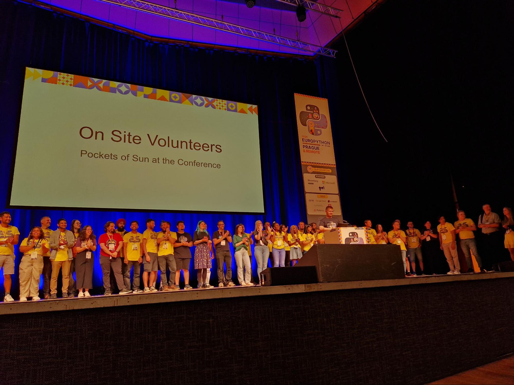
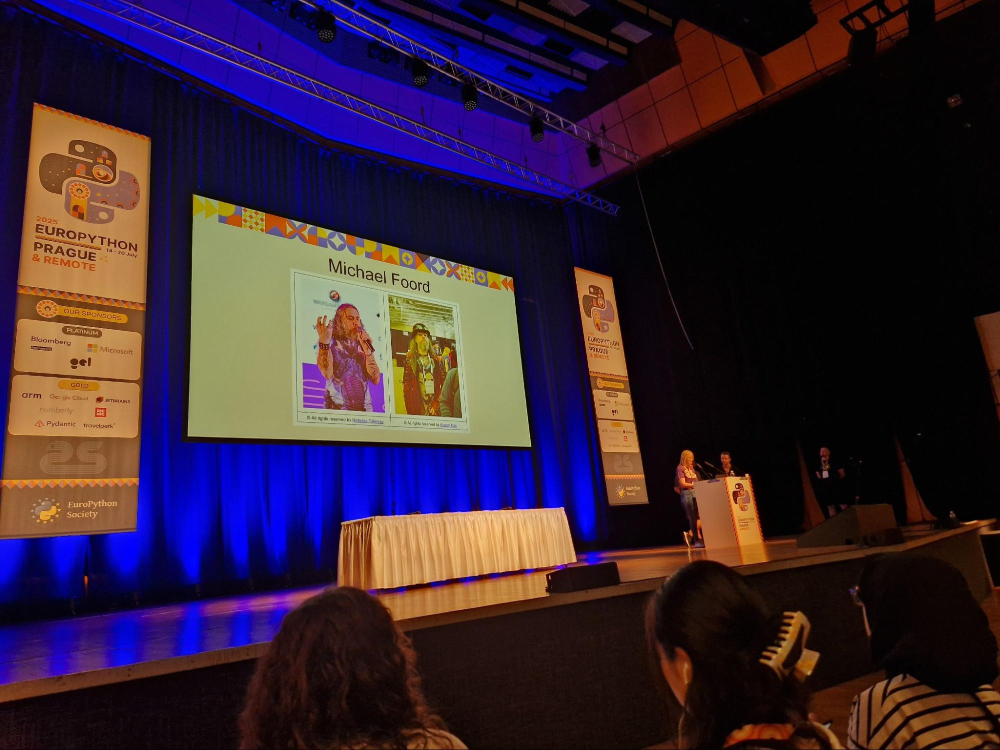
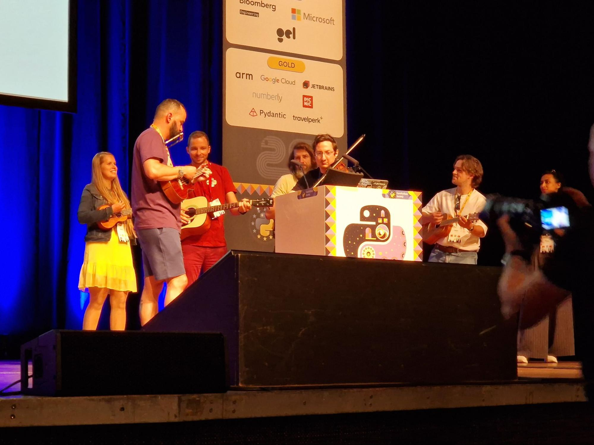
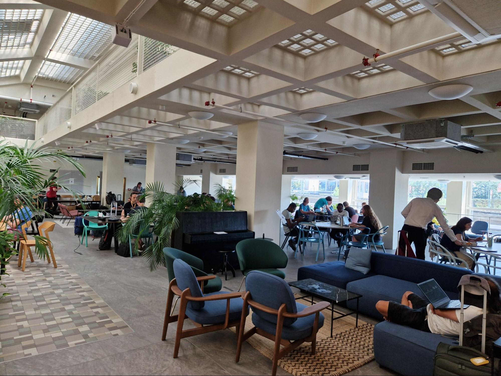
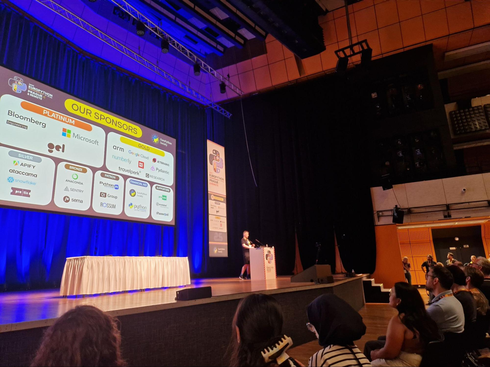

“EruoPython is like a big family reunion every year\!” This is what I said to one of the new attendees on the first day of EuroPython 2025\. If you have been to EuroPython in recent years, I am sure you will agree with me. And this family is growing bigger and bigger every year.

What makes EuroPython special is that it is driven mainly by the community. It is welcoming, and we embrace who we are by being our true selves in this community. It is easy to say that, but to strengthen my point, I would like to give you a couple of examples that happened this year.

## Our Pocket of Sun at the Conference

Every year the volunteers at the conference wear yellow t-shirts to identify themselves. Someone called the volunteer team the “pocket of sun at EuroPython” and I can’t think of a better nickname for them. What they did during the conference is proof that they are truly giving warmth and making the conference bright.

This year there were two sight impaired attendees (one of them was a speaker and returning attendee, which is awesome\!) who required someone to accompany them most of the time at the event. I have seen that being done at other conferences, and how they do it is to hire someone to take on the role. 

When the topic of how we can support those attendees came up in organising meetings, I suggested we also hire someone, as I realized the task of accompanying another person all the time requires a lot of energy and patience. I had thought it would be a burden \- too much work for our team of volunteers. When the team decided the volunteers will take turns to accompany the attendees, I was worried that it may not work well.

How wrong I was\! I underestimated our volunteer team\! Not only do they work as a great team taking turns, they also offer friendship, and help the attendees have a better experience at the conference than being accompanied by someone who is getting paid to do it. The kindness and passion of our volunteers are so great that I doubt any money can buy that kind of service.

They have shown that the community accepts anyone and welcomes them with open arms. The volunteers tried their best to give these attendees a great experience, working with their accessibility requirements. It touches my heart deeply. My deepest respect to those who have taken this challenging task and made these two attendees feel welcomed and as a part of our community, just like everyone else.

## We are Friends, not Just Business Connections

Earlier this year, we lost our great friend Michael. The community and the organisers decided to do a few things to honor him, including reserving a seat for him in the main hall and a memorial session hosted by Nicholas. Michael’s family was watching the memorial session via the livestream. We shared our memories about Michael. There were tears but also laughter, because all the memories with Michael were fun. I am sure he will be missed by many.

This is very unusual in a tech conference, of course. But this proves that we are a community where friendships are real. For many of us, we not only lost a great contributor to the community, but we also lost a good friend who we will always miss.

## We Have so Many Talents

Oh my oh my, where shall I start? Our friend Moises does a little performance at the lightning talks for us every year at EuroPython, from the first year where he just made some beats with `foxdot`, to last year where he gave a full musical performance with a harmonica and ukulele. This year, he upped his game and brought a full ensemble on stage\! A musical group made out of Python nerds was formed\!

However, this group are not the only musical talents in the EuroPython community. If you remember, in 2022’s EuroPython in Ireland, Nicholas  played a grand piano on stage for us. This year we had a piano at our sprint venue, and although Nicholas was not at the sprints, we had another piano star, Wey-Han from Taiwan, playing for us.

This year, we also had multiple dancing and karaoke parties after the conference. Who said nerds cannot party?

## Let’s Keep it Going

If you are like me, a consistent attendee at EuroPython, or if you are someone who attended for the first time, I hope you are already in love with the conference and the community. Remember, a community like this takes time and effort to build. EuroPython is a huge conference that requires a lot of working hours and money to make it happen. If you have time and passion, why not volunteer or join the organising team? If you are working full-time for a company that uses Python and open source libraries, why not encourage them to give back to the community and sponsor EuroPython or any other Python community or event?

My employer, JetBrains, was one of the sponsors this year, and we met a lot of our users and everyone was happy to see us being a part of the community. The community’s success is also our success. As a company, supporting the community is something that can benefit the business, and I hope more and more companies will realize that. As a member of the community, you can be the internal advocate to take this first step \- make EuroPython (or your local PyCon) known by the decision makers in your company.

*That’s it from me this year, hope to see you again at EuroPython 2026\.*

---

*\* while the official photos are still being processed, thank Hugo van Kemenade and the volunteers for providing these amazing pictures*  

Cover Photo by <a href="https://unsplash.com/@jason_derjulio?utm_content=creditCopyText&utm_medium=referral&utm_source=unsplash">Zsombor Buttyán</a> on <a href="https://unsplash.com/photos/white-and-green-bus-on-road-near-building-during-daytime-V7FQKzTyglE?utm_content=creditCopyText&utm_medium=referral&utm_source=unsplash">Unsplash</a>
      